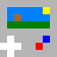

# LuaG Console
LuaG is a virtual console that allows you to build a game very quickly using the lua language.  
The console offers tools for developers, like the integrated editors for the map and the sprites!

## Getting Started
First of all, [download the console](https://github.com/Vulcalien/LuaG-Console/wiki/Download).  
**If you are a developer** open the console, type `mode d` and then `setup`. Now you have blank game files, so you can start programming!  
Just type `files`, find the `script` folder and there will go all your code!

**If you want to play** download a game cartridge, put it in the same folder of the *.jar* file, type `run {cartridge-name}` in the console and enjoy!

## How to create a Game
Creating a Game in LuaG is very easy!  
All Game files are stored inside the folder `console-userdata` (the one you open with the `files` command). Read the [documentation](https://github.com/Vulcalien/LuaG-Console/wiki/Lua-Script) about the game scripting.  
You can use useful tools, such as the integrated editors (map and sprites). Just remember to switch to *developer mode* using `mode d`.  
In this mode you can **run the game directly** without packing it into a cartridge. You can also exit the game pressing `F8`.  
Type `help` to get a list of all the commands you can use.

## Game Deployment
To deploy a LuaG game, you have first to create a `cartridge`. You can do this using `pack {cartridge-name}`.
Now, just publish the cartridge! (I suggest you to leave a link to the [download page](https://github.com/Vulcalien/LuaG-Console/wiki/Download) of LuaG console).

## License
The Console is released under Apache 2.0 license. See [License](LICENSE).

## Built With
- [Bitmap Utility](https://github.com/Vulcalien/Bitmap-Utility) by [Vulcalien](https://github.com/Vulcalien/)
- [Gson](https://github.com/google/gson) by [Google](https://github.com/google)
- [LuaJ](http://www.luaj.org/luaj.html) by [LuaJ](http://www.luaj.org/)

## More Details
[Click here](https://github.com/Vulcalien/LuaG-Console/wiki) to see the wiki.
